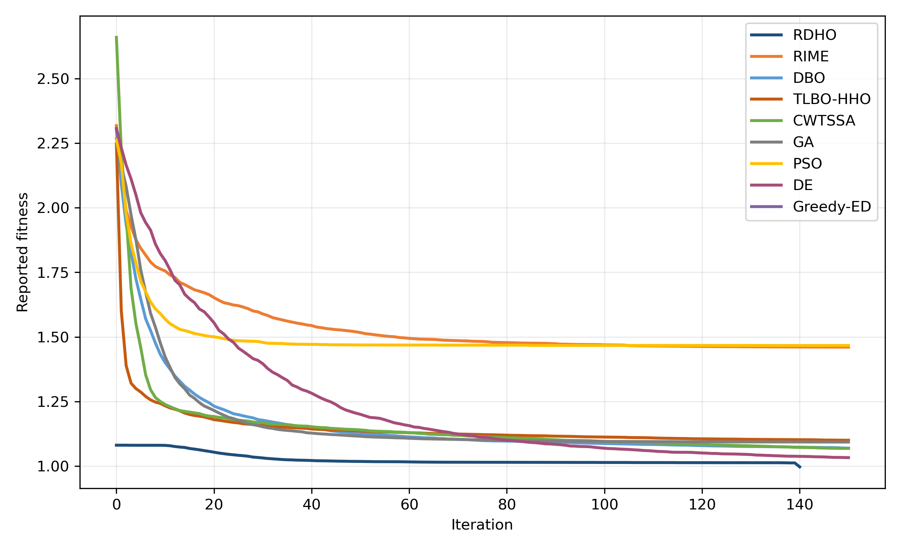

# MEC RDHO Offloading Research Repository

**Manuscript:** *RIME-DBO-Based QoE- and Fairness-Aware Task Offloading in Mobile Edge Computing*
**Status:** Manuscript in preparation

This repository is a reproducible research artefact for a simulated mobile-edge-computing (MEC) task-offloading problem. For every generated task, the optimizer selects local, edge, or cloud execution and a normalized service-intensity control. The study evaluates a weighted trade-off among mobile-device energy, delay, a single-epoch AoI surrogate, priority-weighted QoE, and Jain fairness. Its evidence is configuration-driven and preserved as raw outputs, summaries, figures, and tests.

[](https://github.com/Ryan-Yii/mec-rdho-offloading/actions/workflows/tests.yml)
[](https://github.com/Ryan-Yii/mec-rdho-offloading/releases/tag/v1.0-paper)
[](LICENSE)

## Research Snapshot

- **Problem:** simulated MEC task offloading across local, edge, and cloud execution modes.
- **Decision variables:** execution mode and bounded normalized service intensity; associations and communication rates are fixed scenario parameters.
- **Objective:** a weighted energy, delay, AoI-surrogate, QoE-proxy, and fairness objective with soft constraint-satisfaction reporting.
- **Canonical benchmark:** 30 paired scenarios, six primary algorithms, fixed configurations, and separate algorithm random streams.
- **Evidence beyond the main benchmark:** local-refinement ablation, objective-weight and dynamic-penalty sensitivity, scalability analysis, and paired statistical analysis.
- **Status:** manuscript in preparation; results describe the supplied simulated configurations and do not claim universal superiority or real deployment validation.

## Main Evidence

The [canonical configuration](configs/main_40tasks.yaml) specifies 20 devices, 4 edge servers, 2 cloud servers, 40 tasks, population 50, 150 iterations, and 30 paired runs. The primary algorithms are **RDHO-full**, **RIME**, **DBO**, **TLBO-HHO**, **CWTSSA**, and **Greedy-ED**; `RDHO-core` is a local-refinement ablation, not an additional primary baseline.

- [Raw paired main results](results/raw/main_30_raw_results.csv), [main summary](results/summary/main_30_summary_mean_std.csv), and [convergence records](results/raw/main_30_convergence.csv)
- [Paired Wilcoxon results](results/summary/wilcoxon_fitness_results.csv) and [main manuscript table](paper_tables/main_30_summary_mean_std.md)
- [Ablation raw results](results/raw/ablation_30_raw_results.csv) and [summary](results/summary/ablation_30_summary_mean_std.csv)
- [Scalability raw results](results/raw/scalability_raw_results.csv) and [summary](results/summary/scalability_summary_mean_std.csv)
- [Sensitivity raw outputs](results/sensitivity/raw), [sensitivity summaries](results/sensitivity/summary), and [figures](figures)
- [Reproducibility release](https://github.com/Ryan-Yii/mec-rdho-offloading/releases/tag/v1.0-paper), [software citation](CITATION.cff), and [data availability statement](data_availability.md)



## Quick Reproduction

### Level 1: install and test

```bash
python -m pip install -r requirements.txt
python -m pytest tests -q
```

### Level 2: focused pipeline smoke check

```bash
python -m pytest tests/test_experiment_pipeline.py -q
```

This focused test exercises a reduced scenario through the experiment pipeline. It verifies that the execution path runs; it does **not** reproduce manuscript results and does not write into the committed result directories.

### Level 3: full experiments

```bash
python -m experiments.run_main_30
python -m experiments.run_ablation_30
python -m experiments.run_scalability
python -m experiments.run_sensitivity
```

The full runs can take substantial time. They use deterministic scenario seeds: within a run ID, compared algorithms receive the same generated tasks and network configuration, while algorithm-specific random streams are derived separately.

## Main Benchmark

| Algorithm | Reporting fitness | QoE | Priority-aware fairness | Soft CSR | Runtime (s) | NFE |
| --- | ---: | ---: | ---: | ---: | ---: | ---: |
| RDHO-full | 0.9571 | 0.3270 | 0.9388 | 0.7089 | 4.2626 | 9112 |
| RIME | 1.3858 | 0.2800 | 0.8972 | 0.5617 | 4.4626 | 7551 |
| DBO | 1.0276 | 0.3177 | 0.9360 | 0.6753 | 4.3956 | 7551 |
| TLBO-HHO | 1.0638 | 0.3164 | 0.9350 | 0.6450 | 4.3127 | 7551 |
| CWTSSA | 1.0258 | 0.3195 | 0.9383 | 0.6728 | 4.3180 | 7551 |
| Greedy-ED | 1.0420 | 0.3236 | 0.9389 | 0.6272 | 0.1995 | 361 |

The table is a weighted trade-off under the canonical configuration, not dominance on every metric. In these outputs, RDHO-full has the lowest mean fixed-reference reporting fitness; TLBO-HHO has the lowest energy, while Greedy-ED has the lowest delay, AoI, and runtime. The paired test artefacts above record the corresponding comparisons.

## Method and Scope

The implementation distinguishes the base objective, the iteration-dependent search fitness used by RDHO, and the fixed-reference reporting fitness used for final comparisons. Soft delay, battery-adjusted energy, and AoI conditions are summarized by the soft constraint-satisfaction ratio (CSR).

`RDHO-full` includes the configured coordinate-wise local-refinement stage. `RDHO-core` removes only that stage for the ablation. GA, PSO, and DE are not implemented or reported in this branch's canonical benchmark; this repository makes no primary-comparison claim about them. If such methods are retained in a future extended or historical evaluation, they should be kept separate from the current primary manuscript benchmark.

## My Contributions

The [provenance notice](NOTICE.md) records that this work builds on an earlier group research framework. Within that boundary, my documented work in the current research artefact includes:

1. **Methodology and objective alignment:** restructuring the implementation and clarifying the implemented mode-and-service-intensity optimization scope.
2. **Experimental design and paired evaluation:** configuration-driven main runs, seed handling, consistent scenario generation, and baseline comparison.
3. **Ablation, sensitivity, scalability, and statistics:** organizing the supplied analyses and paired statistical outputs.
4. **Reproducibility engineering and artefact organization:** tests, raw outputs, summaries, figures, tables, configurations, and availability documentation.
5. **Manuscript preparation and project coordination:** maintaining the research presentation while preserving contributor and source provenance.

## Repository Structure

```text
configs/          Canonical and auxiliary experiment settings
experiments/      Experiment and analysis entry points
results/          Raw outputs, summaries, and sensitivity artefacts
figures/          Manuscript-facing figures
paper_tables/     Manuscript-facing tables
src/              System model, metrics, task generation, and algorithms
tests/            Regression, alignment, and reproducibility checks
```

## Limitations and Interpretation

- Scenarios are simulated with fixed association and fixed-rate communication parameters.
- QoE is a model-based proxy; it is not human-subject MOS data.
- AoI is a single-epoch surrogate rather than a complete temporal freshness model.
- Results depend on the stated objective, parameter ranges, seeds, implementations, and baseline suite.
- The repository does not claim universal superiority, a real edge-network deployment, or hard satisfaction of every soft service threshold.

## Data, Citation, and Provenance

No proprietary or human-subject data are used. See [data_availability.md](data_availability.md) for generated data and reproduction notes, [CITATION.cff](CITATION.cff) for software citation metadata, and [NOTICE.md](NOTICE.md) for source and contributor provenance. The repository is released under the [MIT License](LICENSE).

## Related Projects

For online distributed execution infrastructure and scheduling-policy experiments, see [mec-distributed-task-scheduler](https://github.com/Ryan-Yii/mec-distributed-task-scheduler).
